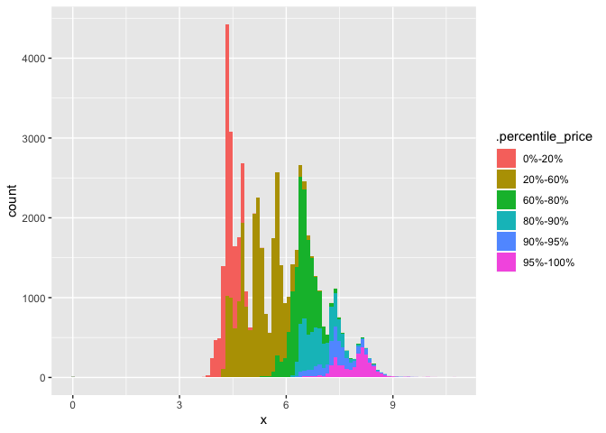

<!-- README.md is generated from README.Rmd. Please edit that file -->

# percentify

<!-- badges: start -->

[](https://www.tidyverse.org/lifecycle/#experimental)
[](https://cran.r-project.org/package=percentify)
<!-- badges: end -->

The goal of percentify is to create virtual groups on top of a `tibble`
or `grouped_df` to allow calculation within percentile ranges of a
variable on the whole dataset. You can then efficiently perform various
dplyr operations on this resampled\_df, like: `summarise()`, `do()` and
`group_map()`.

## Installation

You can install the developmental version of percentify from Github
with:

``` r
devtools::install_github("EmilHvitfeldt/percentify")
```

## Example

Imagine we want to do some summary statistics at the different
percentile ranges of price in diamonds. We start by using
`percentify_cut` to created a `percentiled_df` on price with splits at
`20%`, `60%`, `80%`, `90%` and `95%`.

``` r
library(percentify)
library(tidyverse)
```

``` r
diamonds_price <- percentify_cut(diamonds, price, c(0.2, 0.6, 0.8, 0.9, 0.95))

diamonds_price
#> # A tibble: 53,940 x 10
#> # Groups:   .percentile_price [6]
#>    carat cut       color clarity depth table price     x     y     z
#>    <dbl> <ord>     <ord> <ord>   <dbl> <dbl> <int> <dbl> <dbl> <dbl>
#>  1 0.23  Ideal     E     SI2      61.5    55   326  3.95  3.98  2.43
#>  2 0.21  Premium   E     SI1      59.8    61   326  3.89  3.84  2.31
#>  3 0.23  Good      E     VS1      56.9    65   327  4.05  4.07  2.31
#>  4 0.290 Premium   I     VS2      62.4    58   334  4.2   4.23  2.63
#>  5 0.31  Good      J     SI2      63.3    58   335  4.34  4.35  2.75
#>  6 0.24  Very Good J     VVS2     62.8    57   336  3.94  3.96  2.48
#>  7 0.24  Very Good I     VVS1     62.3    57   336  3.95  3.98  2.47
#>  8 0.26  Very Good H     SI1      61.9    55   337  4.07  4.11  2.53
#>  9 0.22  Fair      E     VS2      65.1    61   337  3.87  3.78  2.49
#> 10 0.23  Very Good H     VS1      59.4    61   338  4     4.05  2.39
#> # … with 53,930 more rows
```

We can then use this grouped data.frame with `summarise` to canculate
statistics within each range.

``` r
summarise(diamonds_price,
          mean_carat = mean(carat),
          procent_ideal = mean(cut == "Ideal"),
          mean_x = mean(x),
          n_obs = n())
#> # A tibble: 6 x 5
#>   .percentile_price mean_carat procent_ideal mean_x n_obs
#>   <chr>                  <dbl>         <dbl>  <dbl> <int>
#> 1 0%-20%                 0.324         0.443   4.40 10796
#> 2 20%-60%                0.566         0.461   5.26 21573
#> 3 60%-80%                1.03          0.281   6.46 10783
#> 4 80%-90%                1.27          0.362   6.91  5395
#> 5 90%-95%                1.56          0.362   7.40  2696
#> 6 95%-100%               1.91          0.317   7.91  2697
```

Using `collect` from dplyr will materialize the groups so they can be
used for plotting or other calculations.

``` r
diamonds_price %>%
  collect() %>%
  ggplot(aes(x, fill = .percentile_price)) +
  geom_histogram(bins = 100)
```



## Inspiration

The underlaying code for this package is inspired by the work done by
[Davis Vaughan](https://twitter.com/dvaughan32) in
[strapgod](https://github.com/DavisVaughan/strapgod).

## Code of Conduct

Please note that the ‘quansum’ project is released with a [Contributor
Code of Conduct](.github/CODE_OF_CONDUCT.md). By contributing to this
project, you agree to abide by its terms.
